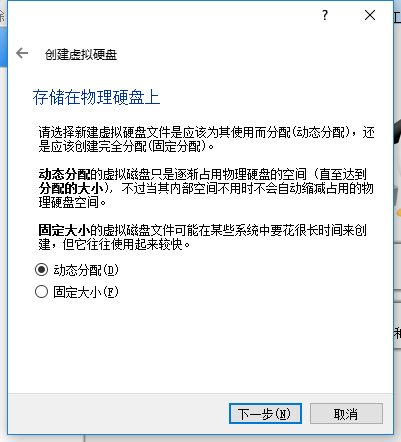
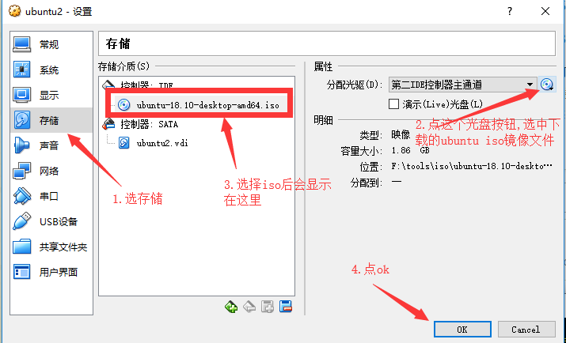
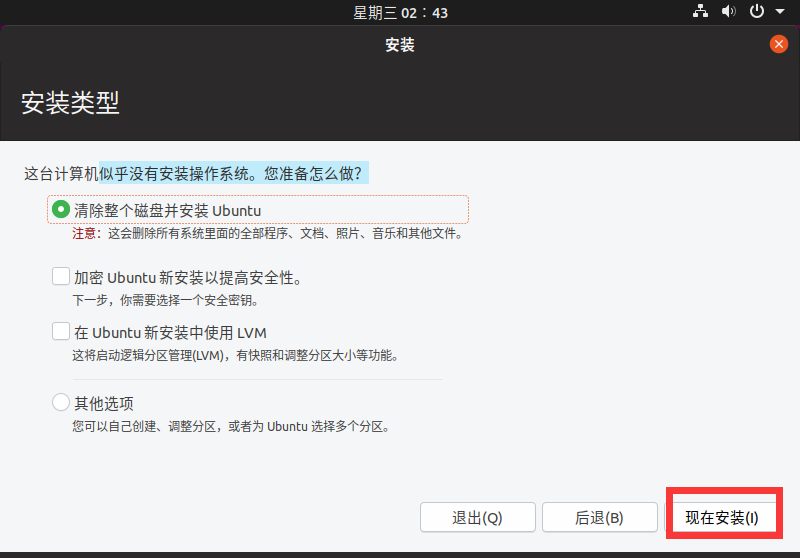
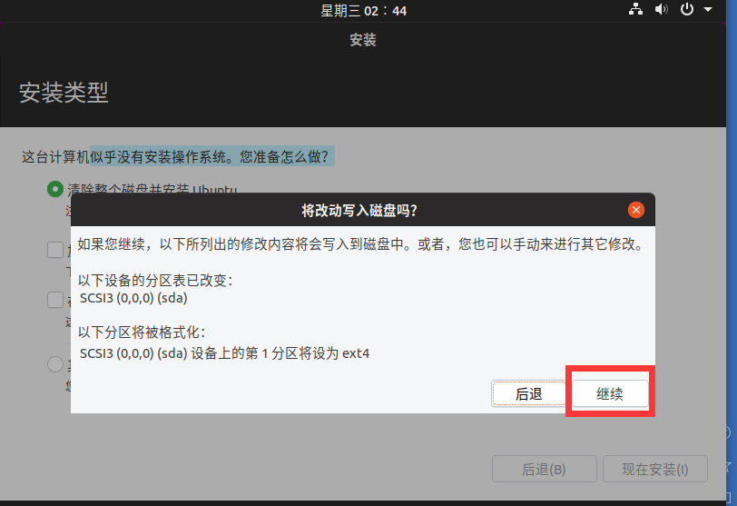
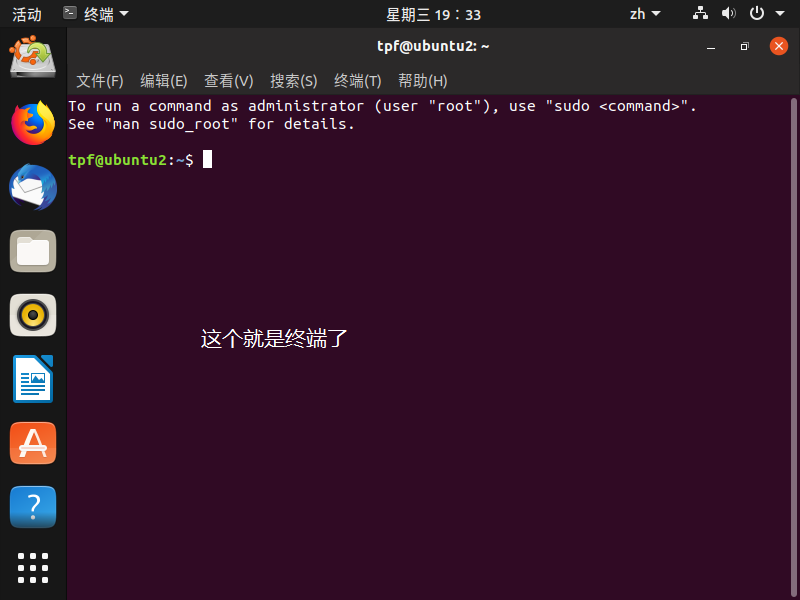

# linux编程入门(一) -使用VirtualBox在Windows下安装Ubuntu虚拟机

&ensp;&ensp;&ensp;&ensp;工作中常有朋友问我linux编程入门的问题，这里我做个整理，为想学习linux的同学做个指引，从安装环境到使用vim编写程序,使用gdb调试程序,使用Makefile编译程序,使用Man手册查看函数说明等，这里并不打算长篇大论的介绍linux下各种函数的使用，而是以熟悉平台为主。  
&ensp;&ensp;&ensp;&ensp;编程语言以c++为主，这里假设各位同学已经掌握了c\++语言。  
&ensp;&ensp;&ensp;&ensp;闲话少说，上车。  

### 需要准备的软件
* VirtualBox虚拟机  
VirtualBox是个开源的虚拟机软件，另一个常用的是VMware。VirtualBox是跨平台的，也就是说VirtualBox本身可以安装在windows,linux,mac下，安装虚拟机只要有镜像就可以，比如安装windows虚拟机，就需要windows镜像，安装linux虚拟机，就需要linux镜像，以前也装过mac虚拟机，不过mac虚拟机体验一点都不好。还是到[VirtualBox官网](https://www.virtualbox.org/wiki/Downloads)上[下载windows版](https://download.virtualbox.org/virtualbox/6.0.4/VirtualBox-6.0.4-128413-Win.exe)安装文件。

* Ubuntu系统镜像  
linux有很多版本，各linux版本的使用差异不大，学会一个其他的就很容易上手了，做为入门，咱们选择ubuntu，ubuntu本身也有很多版本，可以下载最新的LTS(LTS = Long-Term Support,长期技术支持)版本即可。首先到[Ubuntu官网](https://www.ubuntu.com/download/desktop)上[下载](http://mirrors.njupt.edu.cn/ubuntu-releases/18.04.2/ubuntu-18.04.2-desktop-amd64.iso)系统镜像文件,后面安装系统时候需要用到。 

### 安装VirtualBox
和安装一般exe一样,略

### 安装Ubuntu虚拟机















### ubuntu关机
在终端输入命令sudo halt关机,sudo表示用管理员权限执行命令halt
``` c
tpf@tpf-ubuntu:~$ sudo halt
```


### 重启ubuntu
在终端输入命令sudo reboot重启ubuntu
``` c
tpf@tpf-ubuntu:~$ sudo reboot
```


### 设置虚拟机的共享文件夹
