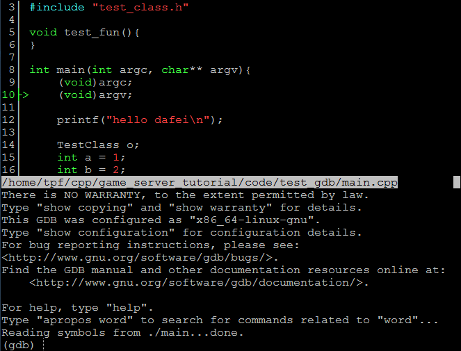
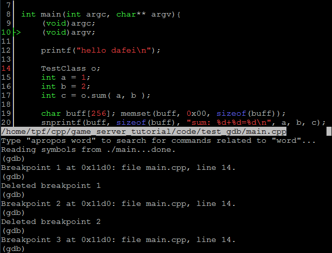
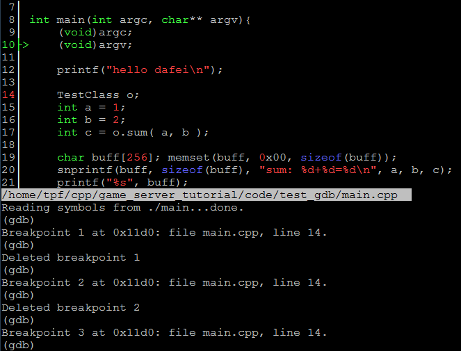
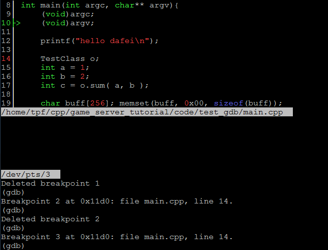

# linux编程入门(八)-使用cgdb为gdb插上翅膀

会用gdb以后就可以看一下cgdb了,cgdb和gdb的命令一样,只是多了一层包装,看代码更方便了,下面我们先看一个动画感受一下  


可以看到用cgdb可以方便的看代码,在相应的行上点空格下断点,再也不需要l显示代码了

## 下断点
先按esc退出输入gdb命令,这时候光标的焦点会切到上面的浏览代码的窗口,按j,k会上下滚动,滚到相应的行上,再按空格就会在该位置下一个断点  

也可以向gdb一样用命令下断点  


## 调整代码窗口的大小
先按esc退出输入gdb命令, 按 '-'或'='号会上下移动窗口分隔栏  


## 打开TTY窗口
tty窗口可以显示程序输出,也可以在这里输入参数  
按shift+t会打开TTY窗口,再按shift+t关闭TTY窗口

按esc后,再按 I 可以把焦点切到tty窗口上
按esc后,再按 i 可以把焦点切到gdb窗口上

## 调整TTY窗口大小
shift+-或shift+=会放大或缩小TTY窗口   



## 按o打开浏览文件  


## 设置文件cgdbrc
可以在cgdbrc里设置个性化显示参数,cgdbrc的位置在: ~/.cgdb/cgdbrc 如果没有可以新建一个  
我这里只设置了tab的宽度为4, 更多设置参数可以[查看文档](http://cgdb.github.io/docs/cgdb.html),打开文档后搜索cgdbrc
``` c
set ts=4
```
